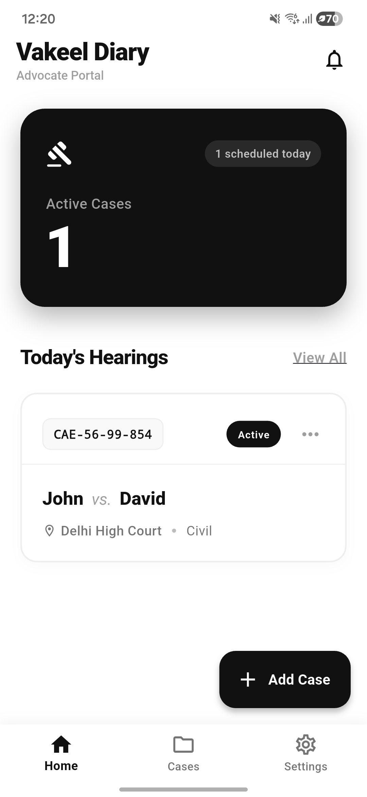
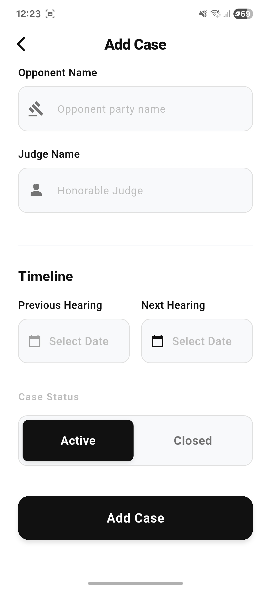
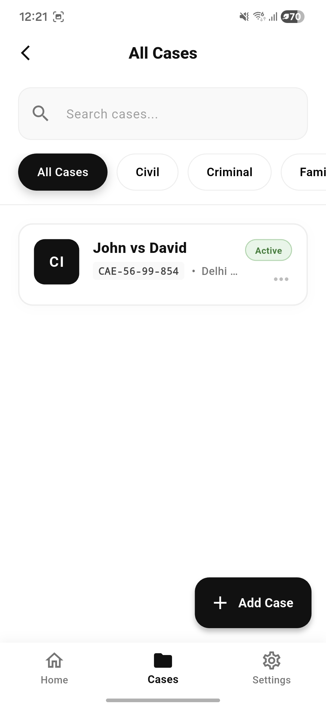
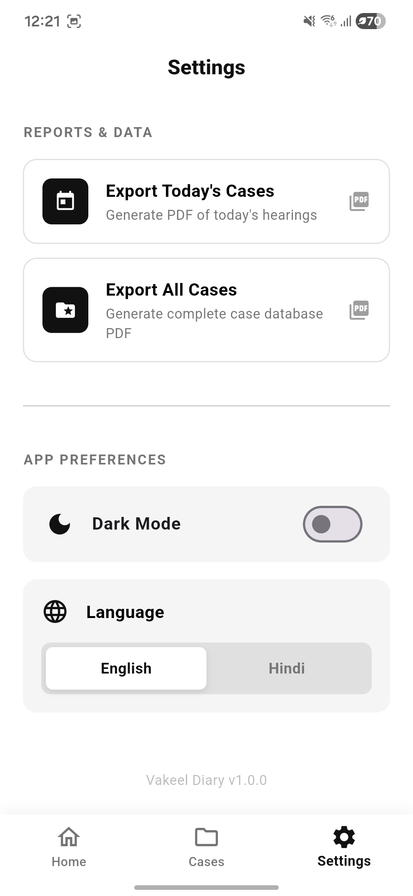
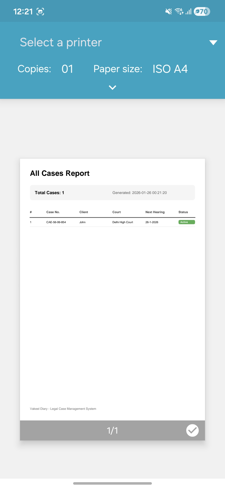

# Vakeel Diary

<div align="center">


**Digitalizing the Indian Legal System, one case at a time.**

[](https://drive.usercontent.google.com/download?id=1-79i6VvJsh_GzYD7O4ipPLRWqF0p1zgJ&export=download&authuser=0)
[](https://vakeel-dairy.vercel.app/)
[](https://github.com/krishgupta-5/vakeel-dairy)
[](https://flutter.dev)

</div>

## 📱 About Vakeel Diary

Vakeel Diary is a comprehensive legal practice management app designed specifically for Indian advocates. Built with a clean, monochrome interface, it helps lawyers manage their cases, track hearings, and organize client information efficiently.

### 🚀 Current Version: 1.0.0

Trusted by 100+ advocates across India, Vakeel Diary simplifies your legal practice with powerful features and an intuitive interface.

## ✨ Key Features

### 📋 Case Management
- Store case numbers, client details, and court information
- Structured, easily searchable database
- Organize cases by status and priority

### 📅 Hearing Tracker
- Never miss a court date with our "Today's Hearings" dashboard
- View daily schedules at a glance
- Smart notifications for upcoming hearings

### 📄 PDF Exports
- Generate professional daily causelists
- Create full case history reports
- One-tap PDF generation for sharing

### 🌐 Multi-Language Support
- English and Hindi support
- Expanding to more regional languages

### 🎨 Clean Interface
- Monochrome design for reduced eye strain
- Distraction-free user experience
- Optimized for legal professionals

## 🛠️ Tech Stack

- **Framework**: Flutter 3.19+
- **Language**: Dart
- **Database**: Hive (Offline-first)
- **State Management**: Provider
- **PDF Generation**: PDF package
- **Internationalization**: Flutter l10n

## 📸 App Screenshots

<div align="center">
  
  
  
  
  
</div>

<br>

<div align="center">
  <strong>Dashboard</strong> • <strong>New Entry</strong> • <strong>Case Directory</strong> • <strong>Settings</strong> • <strong>PDF Export</strong>
</div>

## 🚀 Upcoming Features (v1.1.0)

- 📅 **Advocate Calendar** - Visual calendar for hearings and meetings
- 👥 **Client Management** - Comprehensive client directory
- 🌍 **More Languages** - Additional regional language support
- 🔔 **Smart Notifications** - Timely reminders for important dates
- 🌙 **Dark Mode** - Battery-saving dark interface

## 📥 Installation

### Android (Current)
1. Download the APK from the link below
2. Enable "Install from unknown sources" in your device settings
3. Install the APK and launch the app

[**Download Android App**](https://drive.usercontent.google.com/download?id=1-79i6VvJsh_GzYD7O4ipPLRWqF0p1zgJ&export=download&authuser=0)

### iOS (Coming Soon)
- Currently in development
- Will be available on the App Store

## 🏗️ Development Setup

### Prerequisites
- Flutter SDK 3.19 or higher
- Dart SDK compatible with Flutter version
- Android Studio / VS Code with Flutter extensions

### Clone and Run
```bash
# Clone the repository
git clone https://github.com/krishgupta-5/vakeel-dairy
cd vakeel-dairy

# Install dependencies
flutter pub get

# Run the app
flutter run
```

### Build for Release
```bash
# Android APK
flutter build apk --release

# Android App Bundle
flutter build appbundle --release
```

## 📁 Project Structure

```
lib/
├── generated/           # Auto-generated localization files
├── l10n/               # Localization resources (English, Hindi)
├── models/             # Data models (Case, etc.)
├── providers/          # State management providers
├── screens/            # UI screens
├── utils/              # Utility functions (PDF export, etc.)
├── widgets/            # Reusable UI components
└── main.dart          # App entry point
```

## 🔒 Privacy & Security

- **Offline-First**: All case data stored locally on your device
- **No Cloud Uploads**: Your sensitive data never leaves your device by default
- **Secure Storage**: Encrypted local database using Hive
- **Minimal Permissions**: Only requests essential permissions for functionality

## 👥 Contributors

<div align="center">

**Designed with ❤️ by**

[](https://www.linkedin.com/in/krishgupta7/)
[](https://www.linkedin.com/in/sahilmishra03/)

</div>

## 📞 Support & Contact

- **Email**: support@vakeeldairy.com
- **Website**: [vakeel-dairy.vercel.app](https://vakeel-dairy.vercel.app/)
- **Issues**: [GitHub Issues](https://github.com/sahilmishra03/vakeel-dairy/issues)

## 🤝 Contributing

We welcome contributions! Please read our [Contributing Guidelines](CONTRIBUTING.md) before submitting pull requests.

### How to Contribute
1. Fork the repository
2. Create a feature branch (`git checkout -b feature/AmazingFeature`)
3. Commit your changes (`git commit -m 'Add some AmazingFeature'`)
4. Push to the branch (`git push origin feature/AmazingFeature`)
5. Open a Pull Request

## 📞 Support & Contact

- **Email**: sahilmishra03032005@gmail.com or krishgupta0072@gmail.com
- **Website**: [vakeel-dairy.vercel.app](https://vakeel-dairy.vercel.app/)
- **Issues**: [GitHub Issues](https://github.com/sahilmishra03/vakeel-dairy/issues)
